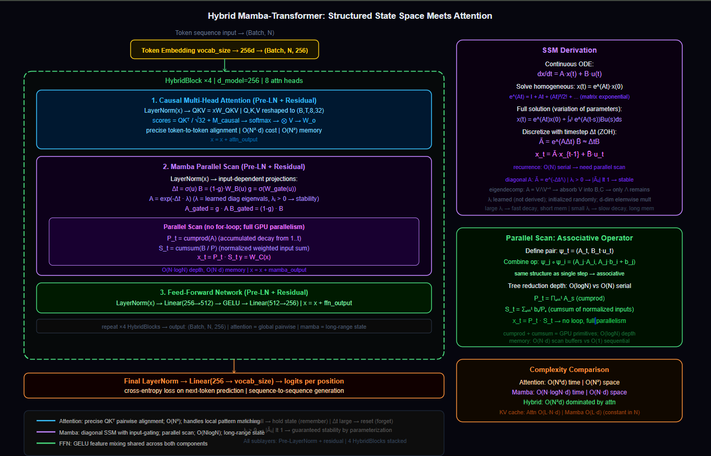

# Hybrid Mamba-Transformer: Structured State Space Meets Attention

---

## The Problem with Pure Transformers : 


**Problem 1 : Quadratic attention cost.** The core operation of a Transformer is $QK^\top$, a matrix multiplication that produces an $N \times N$ attention matrix. For a sequence of length $N$, every token must compute a similarity score against every other token. This scales as $O(N^2)$ in both compute and memory. Double the sequence length and attention cost quadruples. For long sequences like genomic data, audio waveforms, or multi-day financial tick streams, this is not a slow operation; it is an impossible one.

**Problem 2 : KV cache memory explosion.** During autoregressive inference (generating one token at a time), the Transformer caches the Key and Value matrices for every previously generated token. This is necessary to avoid recomputing attention from scratch at each step. But the cache grows linearly with sequence length and never shrinks. For a context window of 100,000 tokens with 32 layers and 8 heads at 128d per head: $100{,}000 \times 32 \times 8 \times 128 \times 2 \times 4$ bytes (float32) $\approx 210$ GB. This exceeds the VRAM of any single GPU. Long-context inference on a pure Transformer is a hardware problem, not a software one.

**Problem 3 : Uniform attention across all positions.** Every token attends to every other token with equal architectural access, regardless of relevance. A token at position 1 and a token at position 50,000 are computationally equivalent. The model must learn which positions matter from data alone, with no inductive bias toward recency or locality. For signals where recent context matters far more than distant context (time series, audio, streaming data), this is wasteful; the model spends capacity learning to ignore most of what it attends to.

---

## The Mamba Alternative: (Treating Time as a System)

The idea behind Mamba is to model sequences as dynamical systems rather than as sets of pairwise relationships. Instead of asking "how every token relate to every other token," it asks "how a hidden state evolve as it absorbs new inputs over time"

This is the continuous-time State Space Model (SSM).

The system is governed by two differential equations :

$$\frac{dx(t)}{dt} = A\,x(t) + B\,u(t)$$

$$y(t) = C\,x(t)$$

Where :
- $x(t) \in \mathbb{R}^d$ is the hidden state at time $t$; the system's memory.
- $u(t) \in \mathbb{R}$ is the input at time $t$.
- $A \in \mathbb{R}^{d \times d}$ governs how the state evolves over time; the memory dynamics.
- $B \in \mathbb{R}^{d \times 1}$ governs how the input is written into the state.
- $C \in \mathbb{R}^{1 \times d}$ governs how the state is read out as the output $y(t)$.

### Derivation of the Solution : 

The equation $\frac{dx}{dt} = Ax + Bu$ is a first-order linear ODE. We solve it by recognizing that without the $Bu$ term, the homogeneous solution is $x(t) = e^{At}x(0)$.

This comes from the definition of the matrix exponential; 

The scalar ODE $\frac{dz}{dt} = az$ has solution $z(t) = e^{at}z(0)$. Extending to matrix $A$: the matrix exponential $e^{At} = I + At + \frac{(At)^2}{2!} + \frac{(At)^3}{3!} + \cdots$ satisfies $\frac{d}{dt}e^{At} = Ae^{At}$, so $x(t) = e^{At}x(0)$ solves the homogeneous case.

For the full system with input, the variation of parameters method gives;

$$x(t) = e^{A t}\,x(0) + \int_0^t e^{A(t-s)} B\,u(s)\,ds$$

This is the general solution. The first term is the initial state decayed/evolved by $A$. The second term is the accumulated contribution of all past inputs, each weighted by how much $A$ has evolved since that input arrived.

---

## Discretization : 

Neural networks operate on discrete token sequences, not continuous signals. To use the SSM on sequences, we discretize with a learnable timestep $\Delta t$ (how much "time" passes between tokens):

$$\bar{A} = e^{A \Delta t}$$

$$\bar{B} = (e^{A\Delta t} - I)A^{-1}B \approx \Delta t \cdot B \quad \text{(Zero-Order Hold approximation)}$$

The discrete recurrence then becomes;

$$x_t = \bar{A}\,x_{t-1} + \bar{B}\,u_t$$

$$y_t = C\,x_t$$

This is a standard linear recurrence. Given the state at $t-1$ and the new input $u_t$, we compute the new state $x_t$ and read out $y_t$.
The system has $O(1)$ memory (just $x_t$) and $O(N)$ compute (one update per timestep). Compared to Transformer attention; $O(N)$ memory and $O(N^2)$ compute.

---

## The Problem with Naive Discretization : 

The most natural choice for $\bar{A}$ is $e^{A\Delta t}$ where $A$ is a free $d \times d$ matrix.

This creates three immediate problems;

**Instability :** For the recurrence $x_t = \bar{A}x_{t-1} + \bar{B}u_t$ to not blow up over long sequences, all eigenvalues of $\bar{A}$ must have magnitude $\leq 1$. A random $d \times d$ matrix has eigenvalues scattered in the complex plane. Enforcing stability for a general matrix requires constrained optimization that is difficult and expensive.

**Parallelism Nightmare :** A full $d \times d$ matrix multiply at every timestep means the recurrence $x_t = \bar{A}x_{t-1} + \bar{B}u_t$ has a dense state transition. We can't trivially parallelize this across timesteps because $x_t$ depends on $x_{t-1}$ through a full matrix.

**Too much Computation :** $d \times d$ matrix multiply at every token costs $O(d^2)$ per step. For $d=256$; 65,536 multiplications per token. For over 10,000 tokens there'll be 655 million multiplications just for the state transitions.

---

## The Diagonal Constraint : 

The solution is to constrain $A$ to be a diagonal matrix. Specifically by representing; $A = -\Lambda$ where $\Lambda$ is a *diagonal matrix of positive real eigenvalues* :

$$\Lambda = \text{diag}(\lambda_1, \lambda_2, \ldots, \lambda_d), \quad \lambda_i > 0$$

Then;

$$\bar{A} = e^{A\Delta t} = e^{-\Lambda \Delta t} = \text{diag}(e^{-\lambda_1 \Delta t},\; e^{-\lambda_2 \Delta t},\; \ldots,\; e^{-\lambda_d \Delta t})$$

The **exponential of a diagonal matrix is just the diagonal matrix of exponentials**.

### Significance of the Diagonal Matrix (Eigenvalue Decomposition) : 

Any matrix $A$ can be written as $A = V\Lambda V^{-1}$ where $\Lambda$ is diagonal (containing eigenvalues) and $V$ contains the eigenvectors.
Then;

$$e^{A\Delta t} = V\,e^{\Lambda \Delta t}\,V^{-1}$$

In the full eigendecomposition, we need $V$ and $V^{-1}$ (the eigenvectors). The key in the Mamba design is; the eigenvectors $V$ can be absorbed into the $B$ and $C$ projections. Since $B$ maps input to state and $C$ maps state to output, we can fold $V^{-1}$ into $B$ and $V$ into $C$. Remaining is just the diagonal $\Lambda$.

So working in the diagonal basis is a *reparameterization* that separates the "remembered" ($\Lambda$: eigenvalues, time evolution) from the "extracted" ($B$, $C$; feature interactions).

**The $\lambda_i$ are learned parameters, initialized randomly.** They are not derived from any eigendecomposition of a real matrix. The model learns them end-to-end, and they converge to values that are useful for the task.

### Three Advantages of Diagonal $\bar{A}$ : 

**1. Guaranteed stability when $\lambda_i > 0$ :**

$$|\bar{A}_{ii}| = e^{-\lambda_i \Delta t} < 1 \quad \text{for all } \lambda_i > 0, \Delta t > 0$$

Each diagonal entry is a decay factor strictly between 0 and 1. The state magnitude can never blow up. Stability is guaranteed by the parameterization, not by constrained optimization.

**2. Elementwise multiplication instead of matrix multiply :**

The state update becomes;

$$x_t^{(i)} = e^{-\lambda_i \Delta t}\,x_{t-1}^{(i)} + \bar{B}^{(i)}\,u_t$$

Each dimension $i$ of the state evolves independently. No cross-dimension coupling in the $A$ transition. This is $O(d)$ per step instead of $O(d^2)$.

**3. Interpretability of eigenvalues :**

$\lambda_i$ controls how fast dimension $i$ of the state forgets the past. Large $\lambda_i$: fast decay, short memory. Small $\lambda_i$; slow decay, long memory. A mix of eigenvalues gives the model multi-timescale memory as some dimensions track recent inputs, others track long-range context.

---

## Selective SSM (Input-Dependent Gating) : 

Classic SSMs have fixed $A$, $B$, $C$ matrices. Every input is processed the same way regardless of content. This is the key weakness as the system cannot decide to "pay attention" to some inputs and ignore others.

Selective SSMs (Mamba) make $B$, $C$, and the timestep $\Delta t$ functions of the input :

$$\Delta_t = \sigma(u_t W_\Delta + b_\Delta)$$

$$B_t = u_t W_B$$

$$C_t = u_t W_C$$

Now the effective $\bar{A}_t = e^{-\Delta_t \Lambda}$ is also input-dependent through $\Delta_t$.
The discrete recurrence becomes :

$$x_t = \bar{A}_t\,x_{t-1} + \bar{B}_t\,u_t$$

$$y_t = C_t\,x_t$$

**The role of $\Delta_t$ in controlling memory :**

- $\Delta_t \to 0$ (small timestep): $\bar{A}_t = e^{-\Delta_t \Lambda} \to I$ and $\bar{B}_t \to 0$. The state barely changes; the input is nearly ignored. The system "holds" what it has.
- $\Delta_t \to \infty$ (large timestep): $\bar{A}_t \to 0$ and $\bar{B}_t \to W_B^{-1}$ (ZOH limit). The old state is completely forgotten; the state becomes purely the new input. A hard reset.
- Intermediate $\Delta_t$: partial memory retention. The system blends old state with new input in a learned, input-dependent ratio.

This is selective gating ie. the model learns when to remember, when to forget, and when to reset, based on the content of the current input.

---

## The Recurrence Problem : From $O(N)$ Sequential to $O(\log N)$ Parallel

The discrete recurrence $x_t = \bar{A}_t x_{t-1} + \bar{B}_t u_t$ is computed as a for-loop over $t = 1, \ldots, N$. Each step depends on the previous.
This is $O(N)$ sequential operations; no two steps can be computed in parallel. Modern **GPUs thrive on parallelism**; a sequential loop wastes nearly all available compute.

### The Parallel Scan (Prefix Scan) : 

The recurrence is an *associative operation*.

We define a "state pair" $\psi_t = (\bar{A}_t, \bar{B}_t u_t)$ representing "decay coefficient and input contribution at step $t$."

The combining rule for two consecutive pairs is :

$$(\bar{A}_j, b_j) \circ (\bar{A}_i, b_i) = (\bar{A}_j \cdot \bar{A}_i,\;\; \bar{A}_j \cdot b_i + b_j)$$

If we verify; $x_i = \bar{A}_i x_{i-1} + b_i$ and $x_j = \bar{A}_j x_{j-1} + b_j$, then after two steps;

$$x_j = \bar{A}_j(\bar{A}_i x_{i-1} + b_i) + b_j = (\bar{A}_j \bar{A}_i)\,x_{i-1} + (\bar{A}_j b_i + b_j)$$

The combined pair $(\bar{A}_j \bar{A}_i,\; \bar{A}_j b_i + b_j)$ has exactly the same structure as a single-step pair. Hence associativity holds combining pairs of pairs always produces the same form.

### Tree Reduction : $O(\log N)$ Depth 

Since the operation is associative, we can apply it like a tree reduction. For $N = 8$ steps :

**Level 1 :** Combine pairs $(\psi_1, \psi_2)$, $(\psi_3, \psi_4)$, $(\psi_5, \psi_6)$, $(\psi_7, \psi_8)$ in parallel. 4 operations, 4 results.

**Level 2 :** Combine $(\psi_{1:2}, \psi_{3:4})$ and $(\psi_{5:6}, \psi_{7:8})$ in parallel. 2 operations, 2 results.

**Level 3 :** Combine $(\psi_{1:4}, \psi_{5:8})$. 1 operation, final result.

Total depth : $\log_2 8 = 3$ levels. Comparing to the sequential loop; 7 steps, all serial.

In practice (as in the code implementation), this is computed via cumulative product and cumulative sum:

**Step 1 -> Cumulative product of decay factors :**

$$P_t = \prod_{s=1}^{t} \bar{A}_s$$

This gives the total accumulated decay from position 1 through position $t$.

**Step 2 -> Weighted inputs :**

Each input contribution $b_t = \bar{B}_t u_t$ needs to be "forwarded" to the current timestep. The contribution of $b_s$ at time $t > s$ is $b_s \cdot \prod_{r=s+1}^t \bar{A}_r = b_s \cdot P_t / P_s$.

So the normalized contribution is $b_s / P_s$. 
Summing these :

$$S_t = \sum_{s=1}^{t} \frac{b_s}{P_s}$$

**Step 3 -> Recover state :**

$$x_t = P_t \cdot S_t$$

Both $P_t$ (cumulative product) and $S_t$ (cumulative sum) can be computed with no for-loop using `torch.cumprod` and `torch.cumsum`, which are fully parallel GPU primitives.
The entire length-$N$ sequence is processed in parallel. No sequential dependency. Full GPU utilization.

### Summary of Complexity Gains : 

| Operation | Sequential Recurrence | Parallel Scan |
|-----------|----------------------|---------------|
| Compute | $O(N)$ sequential steps | $O(\log N)$ depth |
| Memory | $O(1)$ state | $O(N)$ for scan buffers |
| GPU utilization | Near-zero (serial) | Near-full (parallel) |

---

## Disadvantages of Pure Mamba : 

Mamba is excellent at long-range memory and GPU-efficient inference. But it has real limitations:

**No Bidirectional Context :** The recurrence is causal by design; $x_t$ depends only on $x_{t-1}$ and $u_t$. For tasks where future context matters (understanding a sentence where the subject comes after the verb), pure Mamba struggles. Transformers with bidirectional attention have equal access to all positions.

**Weak at precise token-to-token matching :** Attention's $QK^\top$ directly computes similarity between any pair of tokens. Mamba's state-based approach compresses all past context into a fixed-size hidden state. If the task requires precisely retrieving what was at position 37 from a sequence of length 5,000, the compression may lose that information.

**Fixed state dimension $d$ regardless of content :** The hidden state is always $d$-dimensional regardless of how much information the sequence contains. Attention naturally scales its expressivity with sequence length (more tokens, more attention patterns). Mamba's memory capacity is fixed.

---

## The Hybrid Architecture (Best of Both Worlds) : 

The hybrid model interleaves Mamba and Transformer blocks within the same stack. Each `HybridBlock` contains :

1. **Causal Multi-Head Attention :** handles precise token-to-token relationships, bidirectional pattern matching, and short-to-medium range dependencies where $O(N^2)$ cost is acceptable.

2. **Mamba Parallel Scan :** handles long-range context compression, memory-efficient state evolution, and provides $O(N)$ memory cost that does not blow up the KV cache.

3. **FFN (GELU) :** position-wise nonlinear feature mixing, shared across both components.

All three sublayers use Pre-LayerNorm and residual connections :

$$x = x + \text{Attn}(\text{LN}(x))$$
$$x = x + \text{Mamba}(\text{LN}(x))$$
$$x = x + \text{FFN}(\text{LN}(x))$$

The key property is that the attention sublayer operates in $O(N^2)$ but handles only the patterns that require precise pairwise comparison.
The Mamba sublayer operates in $O(N \log N)$ (parallel scan) and handles temporal state evolution and long-range memory. 

Together, the hybrid does what neither alone can; **precise local attention plus efficient long-range memory**.

---

## Architecture : 

```
Input: token sequence (Batch, N)
    |
Token Embedding : vocab_size → d_model = 256        (Batch, N, 256)
    |
HybridBlock × 4:

    LayerNorm → MultiHeadAttention (8 heads, d_k = 32, causal mask)
                QKᵀ / √32 + M_causal → softmax → ⊗ V
    Residual add

    LayerNorm → MambaScan (parallel scan via cumprod + cumsum)
                Δt = σ(u)          input-dependent timestep
                A  = exp(-Δt · λ)  diagonal decay matrix
                B  = (1-g) · W_B(u)  gated input projection
                A  = g · A           gated decay
                P  = cumprod(A)      accumulated decay
                S  = cumsum(B/P)     normalized input sum
                x  = P · S           state reconstruction
                y  = W_C(x)          output projection
    Residual add

    LayerNorm → FFN (256 → 512 → 256, GELU)
    Residual add

    → (Batch, N, 256)

Final LayerNorm → Linear(256 → vocab_size) → logits
```



---

## Time and Space Complexity : 

Let $N$ = sequence length, $d$ = model dimension (256), $H$ = attention heads (8), $L$ = layers (4).

**Attention sublayer :**

$$\text{Time: } O(N^2 \cdot d) \qquad \text{Space: } O(N^2 + N \cdot d)$$

The $N^2$ attention matrix is the bottleneck. For $N=1{,}024$: $1{,}024^2 \times 256 \approx 268M$ multiplications per layer. For $N=65{,}536$; impractical on any single GPU.

**Mamba sublayer (parallel scan) :**

$$\text{Time: } O(N \log N \cdot d) \qquad \text{Space: } O(N \cdot d)$$

The parallel scan has $\log N$ depth over $N$ operations, each of dimension $d$. Scan buffers for $P$ and $S$ are both $(B, N, d)$. For $N=65{,}536$; the Mamba sublayer is feasible; the attention sublayer is not.
This is the core motivation for the hybrid.

**Inference with KV cache (attention only) :**

$$\text{Space: } O(L \cdot N \cdot d)$$

The *Mamba sublayer requires no KV cache* because its state $x_t$ is a fixed-size $d$-dimensional vector. Only the most recent state needs to be stored for the next step. Total Mamba inference memory is $O(L \cdot d)$, constant in $N$. This is the core advantage over pure Transformer inference.

**Full hybrid per layer :**

$$\text{Time: } O(N^2 d + N \log N \cdot d) = O(N^2 d) \quad \text{(attention dominates)}$$

$$\text{Space: } O(N^2 + N \cdot d) \quad \text{(attention matrix dominates for small } N \text{)}$$

For very long sequences where the attention component is applied only to a local window (sliding window attention), the Mamba component dominates and the hybrid achieves $O(N \log N)$ overall.

---

## Failure Case Analysis :  

**Attention still quadratic within each block :** The hybrid reduces the quadratic cost but does not eliminate it. If full global attention is applied at every layer across the full sequence, the memory bottleneck remains. The hybrid is **most effective when attention is applied locally** (to a window of recent tokens) and Mamba handles the long-range state.

**Mamba parallel scan adds scan buffer overhead :** The $O(N \cdot d)$ scan buffers for $P$ and $S$ are allocated in GPU memory for every Mamba sublayer. For $L=4$ layers and large $N$: this can exceed the $O(N^2)$ attention matrix cost for short sequences. The crossover point where Mamba becomes memory-efficient compared to attention is approximately $N > d$, which for $d = 256$ means sequences longer than 256 tokens.

**Stability of the gated scan :** The implementation adds `1e-6` to $A$ before `cumprod` and `1e-6` to $P$ before inversion. For very long sequences, numerical precision of the cumulative product degrades even with this guard. The product of 10,000 values slightly above zero still approaches zero. 

**No positional encoding in this implementation :** Neither sinusoidal PE nor RoPE is applied. The Mamba component encodes position implicitly through the temporal recurrence. The attention component has no positional information at all; it processes all positions identically. This limits the hybrid's ability to **learn position-sensitive patterns** in the attention sublayer. Adding RoPE to Q and K (as in Llama) would improve this.

**Fixed $\lambda$ initialization :** The eigenvalue parameters $\lambda_i$ are initialized from `torch.randn(d_model)`, which places some $\lambda_i$ near zero or negative. Near-zero $\lambda_i$ creates near-unit diagonal entries in $\bar{A}$, which means those state dimensions have very long memory (slow decay). Negative $\lambda_i$ makes $e^{-\lambda_i \Delta t} > 1$, creating explosive growth in that dimension.

---
